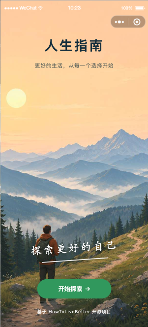
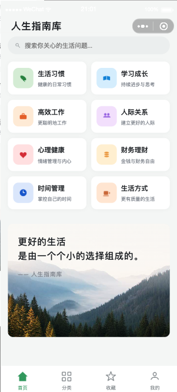
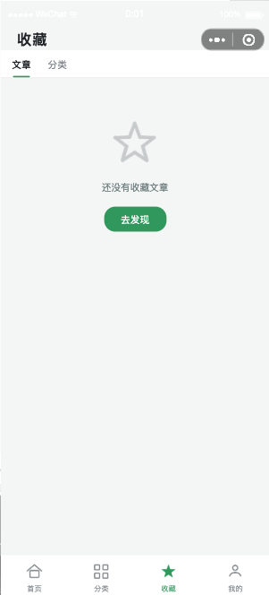
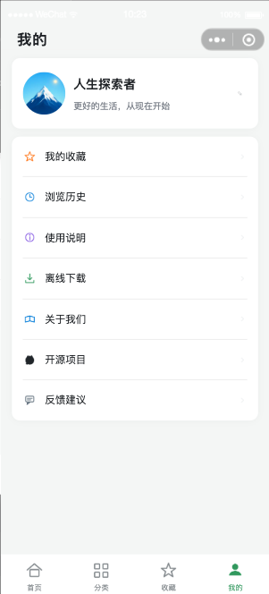
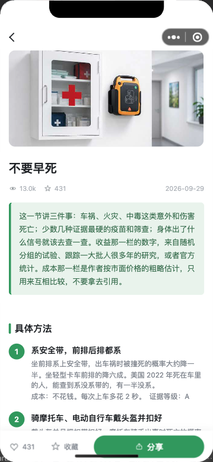
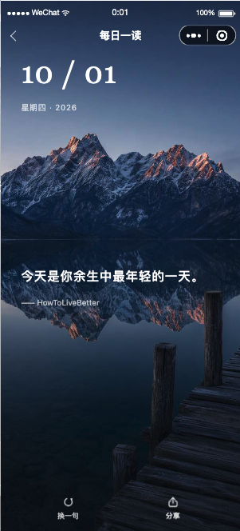

# 高性价比人生指南 · 人生指南库微信小程序

基于 [HowToLiveBetter](https://github.com/eternity4719/HowToLiveBetter) 开源项目数据，把《高性价比人生指南》全书 34 章、667 条循证建议做成移动端阅读体验：每条都标注成本、收益与证据等级（A/B/C），支持分类浏览、全文搜索、收藏与每日一读。

## 预览

微信扫一扫，直接使用线上小程序：

<p align="left">  
    
</p>

界面截图：

<p align="center">  
    
    
    
    
</p>  
<p align="center">  
    
    
    
</p>

## 项目结构

```
miniprogram/
├── app.js / app.json / app.wxss / sitemap.json
├── pages/              # 主包页面
│   ├── index/          # 启动页（非 tabBar 页）
│   ├── home/           # 首页：分类网格 + 搜索 + 推荐语录卡
│   ├── classify/       # 分类：分类标签 + 文章列表
│   ├── favorite/       # 收藏
│   └── mine/           # 我的
├── pagesA/             # 分包：内容详情与工具页
│   ├── category-detail/# 分类详情
│   ├── article/        # 文章详情
│   ├── daily/          # 每日一读
│   ├── search/         # 搜索结果
│   ├── help/           # 使用说明
│   ├── about/          # 关于我们
│   └── webview/        # 外部链接
├── components/         # 公共组件
│   ├── custom-nav/     # 自定义导航栏
│   ├── article-card/   # 文章卡片
│   ├── article-list/   # 文章列表
│   ├── loading/        # 加载动画
│   └── empty-state/    # 空状态
├── data/               # 本地数据（.js 模块，小程序 require 不支持 .json）
│   ├── categories.js   # 8 大分类
│   ├── articles.js     # 文章示例数据
│   └── quotes.js       # 每日一句
├── utils/              # 工具函数
│   ├── util.js         # 通用工具
│   └── data.js         # 数据读取与查询
└── assets/
    ├── icons/          # tabBar、界面与分类图标（脚本生成，见 gen_icons.py）
    └── images/         # 启动页、每日一读、头像与 24 张文章封面（本地 JPEG）

docs/                   # 文档配图：小程序码 + 界面截图（packOptions 已忽略，不入包）
```

## 页面说明

| 页面   | 路径                                       | 说明                  |
| ---- | ---------------------------------------- | ------------------- |
| 启动页  | `pages/index/index`                      | 全屏背景 + 手写体标语 + 开始探索 |
| 首页   | `pages/home/home`                        | 分类网格、即时搜索、推荐语录卡     |
| 分类   | `pages/classify/classify`                | 分类下划线标签 + 文章列表      |
| 分类详情 | `pagesA/category-detail/category-detail` | 子分类标签 + 文章列表        |
| 文章详情 | `pagesA/article/article`                 | 封面、正文、步骤、收藏、分享      |
| 收藏   | `pages/favorite/favorite`                | 文章/分类收藏             |
| 每日一读 | `pagesA/daily/daily`                     | 日期 + 黄昏风景图 + 名言     |
| 我的   | `pages/mine/mine`                        | 用户信息、菜单入口           |
| 搜索   | `pagesA/search/search`                   | 完整搜索结果页             |

## 本地运行

1. 打开微信开发者工具。
2. 选择「导入项目」，目录选择 `miniprogram/`。
3. 在 `project.config.json` 中把 `appid` 改成你的小程序 `appid`。
4. 点击「编译」即可预览。

## 数据说明

当前 `data/articles.js` 已同步 [HowToLiveBetter](https://github.com/eternity4719/HowToLiveBetter) 上游 `book/` 全部 34 章正文：每章转换为一篇文章，章内各条建议转为步骤列表（保留标题、说人话、成本、证据等级），完整证据与来源链接见每篇文末「来源 / 参考」及 GitHub 原文。若需更新内容：

1. 克隆原仓库：
   ```bash
   git clone https://github.com/eternity4719/HowToLiveBetter.git
   ```
2. 原仓库 `book/` 目录下为各章节 Markdown。
3. 按现有 `articles.js` 的字段格式（`summary` / `content` / `steps[{index,title,desc}]` / `source`）转换后替换 `data/articles.js`。
4. 在 `utils/data.js` 中可扩展为异步读取云端数据库或云函数返回的数据。

## 关键配置

- `app.json` 中已配置分包 `pagesA`，并在进入首页时预下载分包。
- 自定义导航栏在 `components/custom-nav` 中实现，支持返回、标题（居中/左对齐大标题）、右侧插槽。
- 收藏与浏览历史使用 `wx.setStorageSync` 本地存储。

## 注意事项

1. `project.config.json` 中 `appid` 为 `touristappid`，正式上线前必须替换。
2. 全部配图与图标已本地化到 `assets/`，主包体积约 1MB 以内；新增图片请注意微信主包 2MB 限制，建议压缩后再放入。
3. `pagesA/webview/webview` 用于打开外部链接，但微信小程序 `web-view` 只能打开配置在「业务域名」中的 HTTPS 链接。GitHub 链接默认无法直接打开，已做剪贴板复制降级处理。
4. 如需接入微信支付、登录、云开发等能力，请参考微信官方文档并在 `app.json` 中补充相关配置。

## 技术栈

- 微信原生小程序
- 无外部 UI 框架依赖
- 数据本地 JS 模块 + Storage

## 版权与许可

本小程序的文字内容改编自 [《高性价比人生指南》](https://github.com/eternity4719/HowToLiveBetter)（作者 [eternity4719](https://github.com/eternity4719)），原书以 [CC BY 4.0](https://creativecommons.org/licenses/by/4.0/) 授权。

本仓库整体（内容与代码）同样以 [CC BY 4.0](LICENSE) 授权。转载或二次分发时，请按 CC BY 4.0 的要求保留对原书及本项目的署名。
